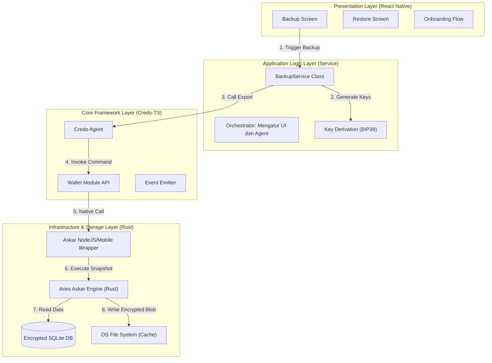

# 01 - System Architecture: Bifold Wallet Backup & Portability Module

**Document Status:** DRAFT v1.0  
**Owner:** Technical Lead / Architecture Team  
**Module:** `BackupService`  
**Context:** Bifold Wallet (Aries Framework JavaScript / Credo-TS)

---

## 1. Executive Summary

Dokumen ini menjabarkan arsitektur teknis untuk fitur **Wallet Portability (Backup & Restore)** pada aplikasi Bifold. Fitur ini krusial untuk memenuhi prinsip Self-Sovereign Identity (SSI) yaitu *Portability*—memastikan user tidak terkunci pada satu perangkat atau vendor.

### 1.1. Tujuan Arsitektur
1.  **Security-First:** Backup harus terenkripsi secara kriptografis "At Rest" dan "In Transit". Tidak boleh ada celah di mana data mentah (raw data) terekspos ke file system tanpa enkripsi.
2.  **Standard Compliance:** Mengikuti spesifikasi **Aries RFC 0050 (Wallet)** dan kompatibel dengan implementasi **Aries Askar**.
3.  **Modularitas:** Kode harus terisolasi dalam *Service Layer* yang bersih, tidak tercampur dengan *UI Logic*.

---

## 2. High-Level Architecture

Sistem ini dibangun di atas arsitektur berlapis (Layered Architecture). Data mengalir dari lapisan antarmuka pengguna, melewati lapisan logika bisnis, hingga ke lapisan penyimpanan fisik yang aman.



---

## 3. Detailed Component Breakdown

### 3.1. Presentation Layer (Frontend)
Lapisan ini hanya bertanggung jawab untuk menampilkan data dan menerima input user. **DILARANG** menaruh logika enkripsi atau akses file system langsung di sini.

*   **BackupScreen:** Menampilkan Mnemonic. Mengakses `BackupService` untuk memulai proses.
*   **RestoreScreen:** Menangani input file (Document Picker) dan input Mnemonic.
*   **Validation:** UI harus memvalidasi format Mnemonic (cek jumlah kata, cek whitelist kata BIP39) sebelum dikirim ke Service Layer.

### 3.2. Application Logic Layer (Service)
Ini adalah "Otak" dari fitur backup. File: `src/services/BackupService.ts`.

*   **Tanggung Jawab:**
    *   **Orkestrasi:** Memastikan Agent dalam keadaan siap sebelum export/import.
    *   **File Management:** Menentukan path sementara (`cache`) yang aman di Android/iOS.
    *   **Cleanup:** Memastikan file sementara dihapus (`unlink`) setelah proses selesai, baik sukses maupun gagal (*Defensive Programming*).
    *   **Key Management:** Memanggil fungsi `bip39` untuk menghasilkan Mnemonic.

### 3.3. Core Framework Layer (Credo-TS)
Kita menggunakan framework standar industri. Modul ini bertindak sebagai *Facade* ke engine native.

*   **Credo Agent:** Kita menggunakan method standar `agent.wallet.export()` dan `agent.wallet.import()`.
*   **Config Injection:** Layer ini menyuntikkan konfigurasi wallet (Kunci enkripsi database lokal, ID Wallet) saat proses import.

### 3.4. Infrastructure Layer (Aries Askar)
Ini adalah lapisan paling kritikal. Aries Askar adalah secure storage engine yang ditulis dalam bahasa **Rust**.

*   **Mengapa Askar?**
    *   **Performance:** Jauh lebih cepat dibanding implementasi JS murni atau Indy SDK lama.
    *   **Security:** Menggunakan *Authenticated Encryption* (ChaCha20-Poly1305). Data tidak hanya dienkripsi, tapi juga ditandatangani untuk mencegah manipulasi.
    *   **Concurrency:** Mendukung akses database multithread yang aman.

---

## 4. Data Flow & Security Protocol

### 4.1. Proses Export (Data At Rest -> Portable File)
Proses ini mengubah database aktif menjadi file portabel.

1.  **Snapshot:** Askar melakukan snapshot terhadap state database saat ini.
2.  **Key Derivation:** Mnemonic (User Input) diolah menggunakan **Argon2** (KDF yang resistance terhadap GPU cracking) untuk menghasilkan *Key Encryption Key (KEK)*.
3.  **Encryption:** Setiap baris data (record) dienkripsi ulang menggunakan KEK tersebut.
4.  **Serialization:** Data biner dibungkus menjadi file tunggal.
5.  **Output:** File disimpan di direktori `Caches` aplikasi, yang bersifat *Sandboxed* (hanya bisa diakses oleh aplikasi itu sendiri).

### 4.2. Proses Transfer (Transport)
Saat file keluar dari Sandbox aplikasi (via Share Sheet):

*   **Security Assumption:** Kita mengasumsikan medium transfer (Google Drive, WhatsApp, Email) adalah *Untrusted*.
*   **Protection:** Keamanan file bergantung 100% pada kekuatan Mnemonic dan algoritma KDF Argon2. Meskipun file dicuri, tanpa Mnemonic, file tidak berguna.

### 4.3. Proses Import (Portable File -> Data At Rest)
Proses ini menghidupkan kembali data mati menjadi database aktif.

1.  **Validation:** Askar mencoba membuka header file menggunakan Mnemonic yang dimasukkan. Jika checksum gagal (Mnemonic salah), proses berhenti total.
2.  **Transcoding:**
    *   Data didekripsi sementara di memori RAM menggunakan Mnemonic.
    *   Data langsung dienkripsi ulang menggunakan **Local Wallet Key** baru yang digenerate oleh aplikasi di HP target.
3.  **Persistence:** Data yang sudah dienkripsi ulang ditulis ke file database SQLite baru di penyimpanan internal HP (`Documents`).

---

## 5. Technical Decisions & Rationale

| Keputusan | Pilihan Teknologi | Alasan (Rationale) |
| :--- | :--- | :--- |
| **Storage Engine** | **Aries Askar** | Standar baru komunitas Aries. Menggantikan Indy SDK yang sudah deprecated. Mendukung custom query yang fleksibel. |
| **Kunci Backup** | **BIP39 Mnemonic** | User-friendly (kata-kata, bukan hex string). Standar global (kompatibel dengan Trinsic/Lissi). Memiliki checksum untuk mencegah typo. |
| **Algoritma KDF** | **Argon2i** | Standar native Askar. Tahan terhadap serangan brute-force menggunakan hardware khusus (ASIC/GPU). |
| **File Format** | **Askar Binary** | Format native yang efisien dan kompak. Tidak memerlukan parsing JSON berat yang memakan memori. |
| **File Handling** | **React Native FS** | Library stabil untuk akses sistem file cross-platform (iOS/Android). |

---

## 6. Integration Points & Interfaces

### 6.1. Service Interface
Berikut adalah kontrak interface yang wajib diimplementasikan oleh tim Backend.

```typescript
interface IBackupService {
  /**
   * Menghasilkan 12 kata acak untuk kunci backup.
   */
  generateMnemonic(): string;

  /**
   * Melakukan full export database wallet.
   * @param key String mnemonic sebagai password.
   * @returns Promise void. Melempar error jika storage penuh.
   */
  exportWallet(key: string): Promise<void>;

  /**
   * Merestore wallet dari file backup.
   * @param path URI lokasi file backup.
   * @param key String mnemonic pembuka.
   * @param newConfig Konfigurasi wallet baru (label, id).
   */
  importWallet(path: string, key: string, newConfig: WalletConfig): Promise<void>;
}
```

---

## 7. Known Limitations & Constraints

1.  **App Versioning:** Import backup dari versi Bifold yang sangat lama ke versi sangat baru *mungkin* memerlukan migrasi skema database. Saat ini kita asumsikan versi Askar kompatibel.
2.  **Mediator Connection:** Koneksi ke Mediator (Routing Agent) tidak otomatis tersambung. Setelah restore, agent perlu melakukan *provisi ulang* ke Mediator agar notifikasi push berjalan. Tim perlu membuat script *Post-Restore Hook* untuk menangani ini.
3.  **Storage Size:** Proses export membutuhkan free space minimal 2x ukuran database (1x untuk DB asli, 1x untuk file backup sementara).

---

**End of Document**  
*Approved by: Architecture Team*
