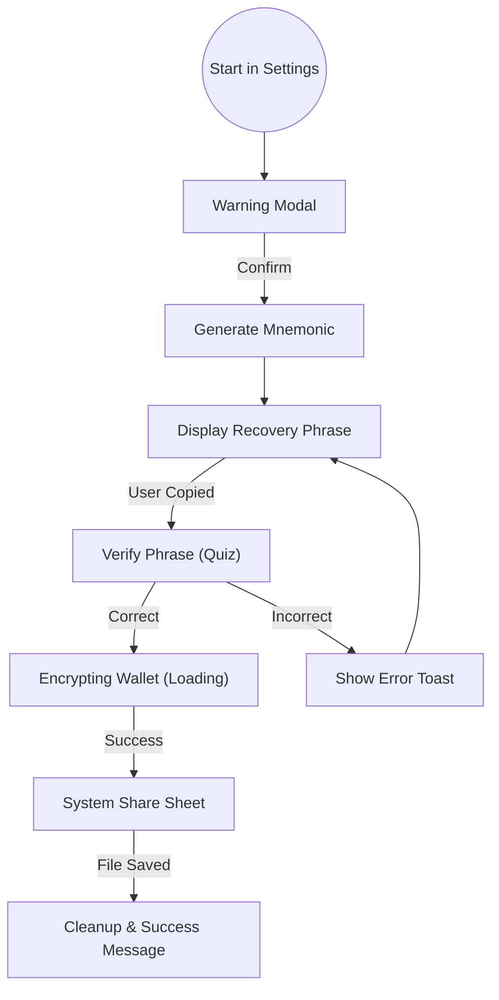
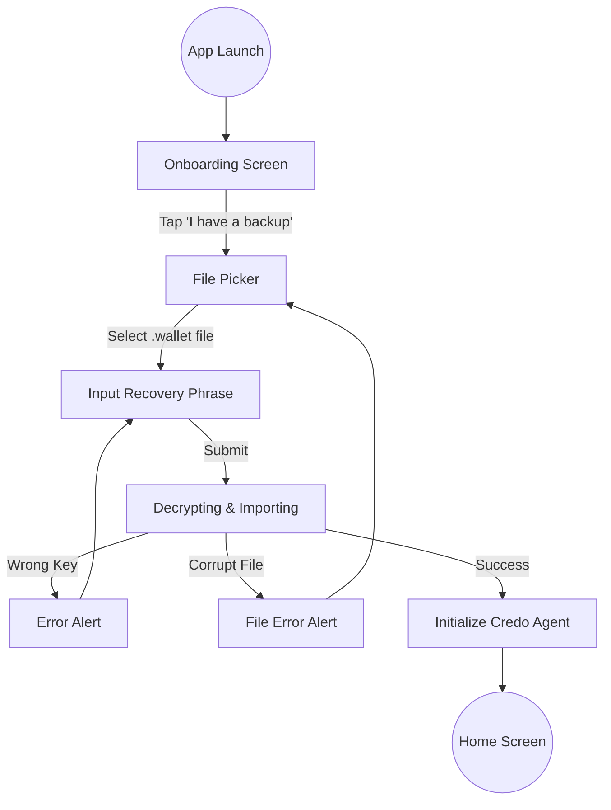

# 02 - User Journey & UX Specification: Wallet Portability

**Document Status:** DRAFT v1.0  
**Owner:** Product Design & Frontend Team  
**Module:** `Backup & Restore`  
**Context:** Bifold Wallet (Credo-TS)

---

## 1. Design Principles (Prinsip Desain)

1.  **Friction for Security:** Jangan membuat proses backup *terlalu* mudah/cepat. Berikan hambatan (friction) yang disengaja agar user sadar bahwa mereka sedang menangani data sensitif.
2.  **No Cloud Assumption:** Jangan asumsikan user punya Google Drive/iCloud. Desain harus mendukung penyimpanan file lokal.
3.  **Fearless Feedback:** Berikan feedback visual yang jelas saat proses enkripsi/dekripsi berjalan (Spinner/Progress Bar), karena proses ini bisa memakan waktu 2-10 detik.

---

## 2. Backup Journey (Export Flow)

### 2.1. High-Level Flowchart

### 2.2. Detailed UI Specifications

#### A. Entry Point
*   **Location:** Settings Screen -> Section "Security" -> Item "Backup Wallet".
*   **Icon:** `shield-checkmark` atau `save-outline`.

#### B. Warning Screen (Critical)
Sebelum menampilkan Mnemonic, user harus menyetujui risiko.
*   **Title:** "Amankan Dompet Digital Anda"
*   **Body Copy:** "Kami akan membuat file cadangan terenkripsi. Anda memerlukan **Kunci Pemulihan (Recovery Phrase)** untuk membukanya kembali. Siapapun yang memiliki kunci ini dapat mengakses identitas Anda."
*   **Action:** Tombol "Saya Mengerti & Lanjutkan" (Primary).

#### C. Recovery Phrase Display
Halaman ini menampilkan 12 kata kunci.
*   **Layout:** Grid 3x4 atau List bernomor.
*   **Security Feature:**
    *   Set `secureTextEntry={true}` atau flag `SECURE_WINDOW` agar tidak bisa di-screenshot.
    *   **NO COPY BUTTON:** Secara default, jangan berikan tombol Copy agar user terpaksa menulis di kertas. (Opsional: Berikan tombol Copy tapi dengan Alert peringatan keras).
*   **Action:** Tombol "Saya Sudah Mencatatnya".

#### D. Verification Screen (The "Quiz")
Memastikan user tidak berbohong bahwa mereka sudah mencatat.
*   **Mechanism:** Tanyakan 2 kata secara acak.
    *   *Contoh:* "Masukkan kata nomor #3 dan #7".
*   **Validation:** Jika salah, reset dan minta user cek catatan mereka lagi.

#### E. System Share Sheet
Setelah verifikasi sukses, `BackupService` akan mengenkripsi database.
*   **State:** Tampilkan **Full Screen Loader** dengan teks "Mengenkripsi Data...".
*   **Action:** Buka dialog share native OS.
    *   *Android:* Intent chooser (Save to Drive, Send to WhatsApp, Save to Files).
    *   *iOS:* UIActivityViewController (Save to Files, AirDrop).
*   **Post-Action:** Setelah dialog share ditutup, kembali ke Settings dan tampilkan "Toast/Snackbar: Backup Berhasil".

---

## 3. Restore Journey (Import Flow)

### 3.1. High-Level Flowchart

### 3.2. Detailed UI Specifications

#### A. Entry Point (Onboarding)
*   **Location:** Layar pertama saat aplikasi baru diinstall.
*   **Primary Button:** "Create New Wallet" (Buat Baru).
*   **Secondary Button:** "I already have a wallet" (Restore/Pulihkan).
    *   *Style:* Text Link atau Outlined Button agar tidak mendominasi.

#### B. File Picker & Input
Halaman ini menggabungkan pemilihan file dan input kunci.
*   **Step 1: File Selection**
    *   Button: "Pilih File Backup".
    *   Display: Tampilkan nama file (`my-wallet.backup`) dan ukuran file (`12 MB`) setelah dipilih.
*   **Step 2: Key Entry**
    *   Input Field: TextArea besar.
    *   **Helper UX:**
        *   Gunakan library `react-native-bip39-autocomplete` (jika ada) atau saran kata di atas keyboard.
        *   Otomatis lowercase semua input.
        *   Abaikan spasi berlebih.
*   **Action:** Tombol "Pulihkan Wallet" (Disabled jika file belum dipilih atau kata < 12).

#### C. Processing State (The "Black Box")
Proses import melibatkan dekripsi berat dan re-enkripsi database SQLite baru.
*   **Visual:** Loading Spinner dengan status berganti-ganti:
    1.  "Membaca File..."
    2.  "Membuka Kunci..."
    3.  "Menyiapkan Database..."
*   **Error Handling:**
    *   *Jika Key Salah:* "Kunci Pemulihan salah. Silakan coba lagi." (Jangan sebutkan "File rusak" agar user tau kesalahannya di password).
    *   *Jika File Rusak:* "Format file tidak dikenali atau rusak."

#### D. Success State
*   **Visual:** Animasi Checkmark hijau.
*   **Transition:** Otomatis pindah ke Home Screen atau layar PIN Setup (jika aplikasi mewajibkan PIN baru).

---

## 4. Edge Cases & Error States

Tim Frontend wajib menangani kondisi-kondisi ini:

| Skenario | Pesan Error (Copywriting) | Tindakan UI |
| :--- | :--- | :--- |
| **Storage Penuh** | "Ruang penyimpanan tidak cukup untuk melakukan backup." | Tampilkan Alert, batalkan proses. |
| **User Cancel Share** | (Tidak perlu error) | Kembali ke layar sebelumnya dengan tenang. |
| **File Backup Hilang** | "File tidak ditemukan. Apakah file sudah dihapus?" | Reset state file picker. |
| **Versi Tidak Kompatibel** | "File backup ini berasal dari versi aplikasi yang lebih baru/lama dan tidak didukung." | Tolak proses import. |

---

## 5. Accessibility (A11y)

*   **Screen Readers:** Pastikan TalkBack/VoiceOver membacakan urutan nomor pada layar Mnemonic ("Kata nomor satu: Apple", "Kata nomor dua: Banana").
*   **Contrast:** Warna teks Mnemonic harus kontras tinggi (Hitam di atas Putih/Abu terang).
*   **Scaling:** Pastikan kotak Mnemonic bisa membesar jika user menggunakan *Large Text settings*.

---

**End of Document**  
*Approved by: Product Design Lead*
