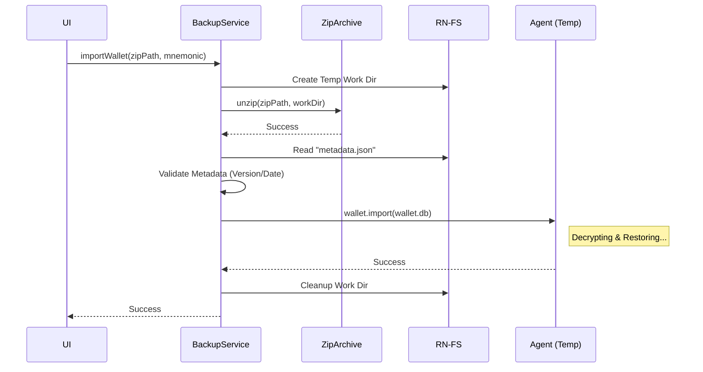

# 04 - Technical Implementation: Import Process (ZIP Standard)

**Document Status:** DRAFT v1.1 (ZIP Support)  
**Owner:** Backend/Core Team  
**Module:** `BackupService` (Import Logic)  
**Context:** Bifold Wallet (Credo-TS)

---

## 1. Overview

Modul ini menangani ekstraksi file ZIP backup, memvalidasi metadata, dan memulihkan database wallet.

### Kebutuhan Library
```bash
yarn add react-native-zip-archive
```

---

## 2. Sequence Logic



---

## 3. Implementation Code

```typescript
import { Agent, WalletConfig, WalletExportImportConfig } from '@aries-framework/core'
import RNFS from 'react-native-fs'
import { unzip } from 'react-native-zip-archive'
import DocumentPicker from 'react-native-document-picker'
import { getAgentDependencies } from '../utils/agent-dependencies' 

export class WalletBackupService {

  // ... (pickAndPrepareFile method sama seperti sebelumnya) ...

  public async importWallet(
    mnemonic: string,
    zipSourcePath: string, // Path file ZIP di cache
    newWalletConfig: WalletConfig
  ): Promise<void> {
    
    const timestamp = new Date().getTime()
    const workDirPath = `${RNFS.CachesDirectoryPath}/import_work_${timestamp}`

    try {
      console.log(`[Import] Preparing workspace: ${workDirPath}`)
      await RNFS.mkdir(workDirPath)

      // 1. UNZIP File
      // Parameter: (SourceZip, TargetFolder)
      console.log('[Import] Unzipping...')
      await unzip(zipSourcePath, workDirPath)

      // 2. Baca Metadata (Opsional tapi Recommended)
      const metadataPath = `${workDirPath}/metadata.json`
      if (await RNFS.exists(metadataPath)) {
        const metaContent = await RNFS.readFile(metadataPath, 'utf8')
        const metadata = JSON.parse(metaContent)
        console.log('[Import] Backup Metadata:', metadata)
        
        // Disini bisa tambah validasi:
        // if (metadata.version !== '1.0') throw new Error('Versi tidak didukung')
      }

      // 3. Cari File Wallet Binary
      const walletDbPath = `${workDirPath}/wallet.db`
      if (!await RNFS.exists(walletDbPath)) {
        throw new Error('File wallet.db tidak ditemukan dalam backup ZIP.')
      }

      // 4. Eksekusi Import Credo
      const tempAgent = new Agent({
        config: {
          label: 'Import-Helper',
          walletConfig: newWalletConfig,
          autoUpdateStorageOnStartup: false,
        },
        dependencies: getAgentDependencies(),
      })

      const importConfig: WalletExportImportConfig = {
        key: mnemonic, 
        path: walletDbPath, // Point ke file binary hasil ekstrak
      }

      console.log('[Import] Restoring to DB...')
      await tempAgent.wallet.import(newWalletConfig, importConfig)

    } catch (error: any) {
      console.error('[Import] Failed:', error)
      // (Error handling mapping sama seperti sebelumnya)
      throw error

    } finally {
      // 5. CLEANUP
      // Hapus folder hasil ekstraksi dan file zip sumber
      try {
        await RNFS.unlink(workDirPath)
        await RNFS.unlink(zipSourcePath)
        console.log('[Import] Cleanup completed.')
      } catch (e) { /* ignore */ }
    }
  }
}
```

---

## 4. Security Note for ZIP
*   **Jangan mengenkripsi ZIP:** File ZIP tidak perlu dipassword (zip password protection standar itu lemah).
*   **Security ada di `wallet.db`:** File binary di dalam ZIP itu SENDIRI sudah terenkripsi kuat oleh Askar/Argon2. Jadi meskipun orang bisa unzip dan lihat `metadata.json`, mereka tetap tidak bisa buka `wallet.db` tanpa Mnemonic.

---

**End of Document**
