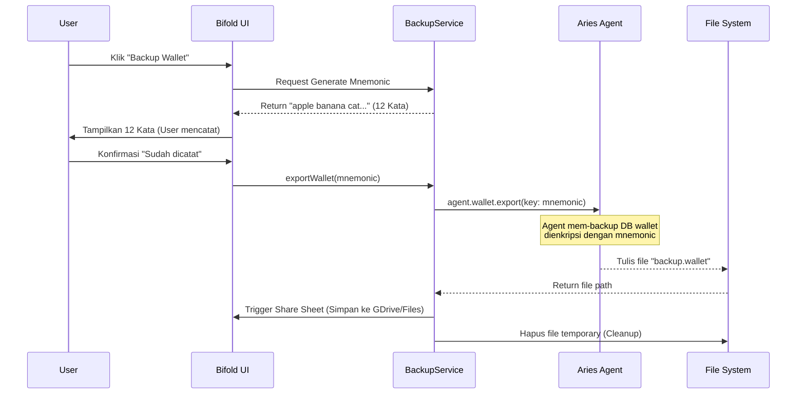
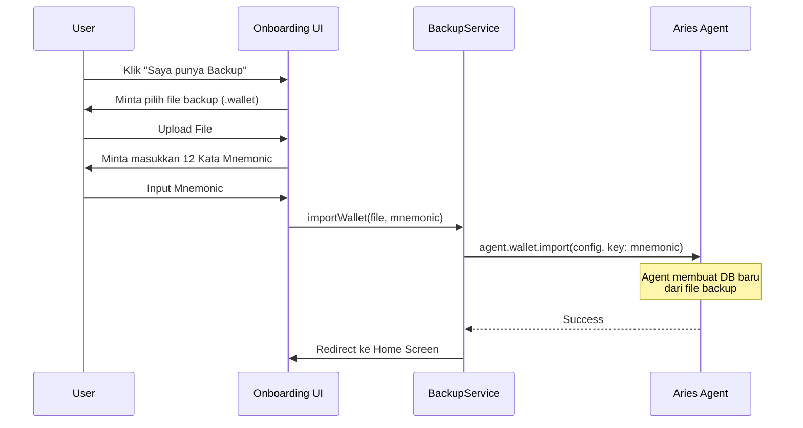

# Blueprint Implementasi Fitur Backup & Restore Wallet (Bifold/Aries)

**Target Audience:** Junior-Mid Developers  
**Framework:** React Native, Aries Framework Javascript (Credo-TS)  
**Tujuan:** Membuat fitur export (backup) dan import (restore) wallet SSI yang aman dan user-friendly.

---

## 1. Konsep Dasar & Alur Kerja (Theory)

Sebelum coding, tim harus paham dulu apa yang terjadi di belakang layar.

### Analogi Sederhana
Bayangkan Wallet itu seperti sebuah **Brankas Besi** (Database Terenkripsi) di dalam HP.
1.  **Export (Backup):** Kita menyalin brankas itu, membungkusnya dengan kotak baja tambahan, dan menguncinya dengan **Kunci Khusus** (12 kata rahasia/Mnemonic). Kotak ini bisa dikirim lewat email/drive.
2.  **Import (Restore):** Kita ambil kotak baja tadi, masukkan **Kunci Khusus** untuk membukanya, lalu menaruh kembali Brankas Besi itu ke dalam HP baru.

### Diagram Alur (Sequence Diagram)

#### A. Alur Backup (Export)


#### B. Alur Restore (Import)


---

## 2. Persiapan (Dependencies)

Buka terminal di folder project Bifold/React Native Anda, dan install library berikut. Ini wajib untuk manajemen file dan kriptografi.

```bash
# 1. Untuk akses file system (baca/tulis file)
yarn add react-native-fs

# 2. Untuk membagikan file backup ke aplikasi lain (GDrive, WhatsApp, dll)
yarn add react-native-share

# 3. Untuk memilih file saat restore
yarn add react-native-document-picker

# 4. Untuk membuat Mnemonic (12 kata rahasia)
yarn add bip39
yarn add react-native-get-random-values

# 5. Pastikan buffer tersedia (biasanya sudah ada di project Aries, tapi cek lagi)
yarn add buffer
```

**Penting:** Untuk iOS, jangan lupa jalankan `pod install` di folder `ios/`.

---

## 3. Implementasi Kode (Backend Logic)

Kita akan membuat satu file khusus yang menangani semua urusan backup. Ini supaya kode rapi dan tidak berantakan di UI.

**Buat file baru:** `src/services/WalletBackupService.ts`

```typescript
import { Agent, WalletExportImportConfig } from '@aries-framework/core'
import RNFS from 'react-native-fs'
import Share from 'react-native-share'
import DocumentPicker from 'react-native-document-picker'
import * as bip39 from 'bip39'

// Menggunakan polyfill untuk random values jika belum ada di global setup
import 'react-native-get-random-values' 

export class WalletBackupService {
  
  /**
   * GENERATE RECOVERY PHRASE
   * Membuat 12 kata acak (Mnemonic) standar BIP39.
   * Kata-kata ini adalah "Password" untuk file backup nanti.
   */
  public generateMnemonic(): string {
    // 128 bit entropy menghasilkan 12 kata
    return bip39.generateMnemonic(128)
  }

  /**
   * EXPORT WALLET
   * @param agent Instance agent yang sedang aktif
   * @param mnemonic String 12 kata yang digenerate di atas
   */
  public async exportWallet(agent: Agent, mnemonic: string): Promise<void> {
    const timestamp = new Date().toISOString().split('T')[0] // Format: 2024-01-07
    const fileName = `wallet_backup_${timestamp}.wallet`
    const destinationPath = `${RNFS.CachesDirectoryPath}/${fileName}`

    try {
      // 1. Konfigurasi Export
      const exportConfig: WalletExportImportConfig = {
        key: mnemonic, // Mnemonic digunakan sebagai kunci enkripsi
        path: destinationPath,
      }

      console.log('Starting export to:', destinationPath)

      // 2. Perintah Export (Ini fungsi bawaan Aries Framework)
      // Proses ini akan membekukan database sebentar
      await agent.wallet.export(exportConfig)

      // 3. Buka Share Dialog (Agar user bisa simpan ke GDrive/Files)
      await Share.open({
        title: 'Simpan Backup Wallet',
        url: `file://${destinationPath}`,
        type: 'application/octet-stream', // Tipe file binary
        failOnCancel: false,
      })

    } catch (error) {
      console.error('Export Error:', error)
      throw new Error('Gagal melakukan backup wallet. Pastikan storage cukup.')
    } finally {
      // 4. CLEANUP (Sangat Penting!)
      // Hapus file backup dari cache HP setelah dishare agar tidak dicuri orang
      const fileExists = await RNFS.exists(destinationPath)
      if (fileExists) {
        await RNFS.unlink(destinationPath)
      }
    }
  }

  /**
   * PICK BACKUP FILE
   * Membuka file manager agar user bisa memilih file backup
   */
  public async pickBackupFile(): Promise<string | null> {
    try {
      const res = await DocumentPicker.pickSingle({
        type: [DocumentPicker.types.allFiles],
        copyTo: 'cachesDirectory', // Salin ke cache agar bisa dibaca app
      })
      
      return res.fileCopyUri // Mengembalikan path file yang bisa dibaca
    } catch (err) {
      if (DocumentPicker.isCancel(err)) {
        return null // User membatalkan
      }
      throw err
    }
  }

  /**
   * IMPORT WALLET
   * Fungsi ini dipanggil SAAT APLIKASI PERTAMA DIBUKA (belum ada wallet)
   * @param agent Instance agent (belum di-inialize)
   * @param walletConfig Config wallet baru (id, key, label)
   * @param backupPath Path file yang dipilih user
   * @param mnemonic 12 kata yang dimasukkan user
   */
  public async importWallet(
    agent: Agent,
    walletConfig: any, 
    backupPath: string,
    mnemonic: string
  ): Promise<void> {
    try {
      // Kita perlu memastikan path formatnya benar untuk Aries
      // Di Android kadang ada prefix 'file://' yang harus dihandle
      const cleanPath = backupPath.replace('file://', '')

      const importConfig: WalletExportImportConfig = {
        key: mnemonic,
        path: cleanPath,
      }

      console.log('Starting import from:', cleanPath)

      // Perintah Import
      // Ini akan membuat file database wallet baru dari backup
      await agent.wallet.import(walletConfig, importConfig)
      
      console.log('Wallet imported successfully!')

    } catch (error) {
      console.error('Import Error:', error)
      throw new Error('Gagal restore wallet. Pastikan 12 kata benar dan file tidak rusak.')
    }
  }
}
```

---

## 4. Implementasi UI (Tampilan Layar)

Implementasikan ini di file Screen komponen React Native Anda.

### A. Layar Backup (Export)

Buat screen baru: `BackupWalletScreen.tsx`.

**Logic:**
1.  Saat layar dibuka, panggil `service.generateMnemonic()`.
2.  Tampilkan Mnemonic di layar.
3.  Tombol "Backup Sekarang" memanggil `service.exportWallet()`.

```tsx
import React, { useState, useEffect } from 'react'
import { View, Text, Button, Alert, ActivityIndicator } from 'react-native'
import { useAgent } from '@aries-framework/react-hooks' // Sesuaikan dengan setup Bifold Anda
import { WalletBackupService } from '../services/WalletBackupService'

const backupService = new WalletBackupService()

export const BackupWalletScreen = () => {
  const { agent } = useAgent()
  const [mnemonic, setMnemonic] = useState<string>('')
  const [loading, setLoading] = useState(false)

  // 1. Generate Mnemonic saat layar dimuat
  useEffect(() => {
    const phrase = backupService.generateMnemonic()
    setMnemonic(phrase)
  }, [])

  // 2. Fungsi Eksekusi Backup
  const handleBackup = async () => {
    if (!agent) return
    setLoading(true)
    try {
      await backupService.exportWallet(agent, mnemonic)
      Alert.alert('Sukses', 'Wallet berhasil dibackup!')
    } catch (error: any) {
      Alert.alert('Gagal', error.message)
    } finally {
      setLoading(false)
    }
  }

  return (
    <View style={{ padding: 20 }}>
      <Text style={{ fontSize: 18, fontWeight: 'bold' }}>Recovery Phrase</Text>
      <Text style={{ marginVertical: 10, color: 'red' }}>
        CATAT KODE INI DI KERTAS. Jangan disimpan di HP.
      </Text>
      
      {/* Tampilkan Mnemonic */}
      <View style={{ backgroundColor: '#f0f0f0', padding: 15, borderRadius: 8 }}>
        <Text style={{ fontSize: 16, lineHeight: 24 }}>{mnemonic}</Text>
      </View>

      <View style={{ marginTop: 20 }}>
        {loading ? (
          <ActivityIndicator size="large" />
        ) : (
          <Button title="Download Backup File" onPress={handleBackup} />
        )}
      </View>
    </View>
  )
}
```

### B. Layar Restore (Import)

Ini biasanya ditaruh di halaman **Onboarding**, di bawah tombol "Create New Wallet".
Buat screen: `RestoreWalletScreen.tsx`.

**Logic:**
1.  Tombol "Pilih File" memanggil `service.pickBackupFile()`.
2.  Input Text untuk memasukkan Mnemonic.
3.  Tombol "Restore" memanggil `service.importWallet()`.

```tsx
import React, { useState } from 'react'
import { View, Text, TextInput, Button, Alert, ActivityIndicator } from 'react-native'
import { WalletBackupService } from '../services/WalletBackupService'
// Import konfigurasi agent dasar Anda (tapi jangan di-init dulu)
import { createAgentConfig } from '../utils/agentConfig' 
import { Agent } from '@aries-framework/core'

const backupService = new WalletBackupService()

export const RestoreWalletScreen = ({ navigation }: any) => {
  const [filePath, setFilePath] = useState<string | null>(null)
  const [inputMnemonic, setInputMnemonic] = useState('')
  const [loading, setLoading] = useState(false)

  const handlePickFile = async () => {
    const path = await backupService.pickBackupFile()
    if (path) setFilePath(path)
  }

  const handleRestore = async () => {
    if (!filePath || !inputMnemonic) {
      Alert.alert('Error', 'Mohon lengkapi file dan mnemonic.')
      return
    }

    setLoading(true)
    try {
      // 1. Setup konfigurasi agent sementara
      // Gunakan konfigurasi standar aplikasi Anda
      // Penting: Gunakan walletId dan key yang sama seperti standar aplikasi Anda
      const config = createAgentConfig('WalletLabel', 'wallet-id', 'wallet-key') 
      const tempAgent = new Agent(config)

      // 2. Lakukan Import
      // Note: Kita tidak perlu initialize() agent untuk melakukan import wallet
      await backupService.importWallet(tempAgent, config.walletConfig, filePath, inputMnemonic)

      Alert.alert('Sukses', 'Wallet berhasil dipulihkan! Silakan login.', [
        { text: 'OK', onPress: () => navigation.navigate('Login') }
      ])
    } catch (error: any) {
      Alert.alert('Gagal', error.message)
    } finally {
      setLoading(false)
    }
  }

  return (
    <View style={{ padding: 20 }}>
      <Text style={{ fontSize: 20, marginBottom: 20 }}>Restore Wallet</Text>

      {/* Step 1: File */}
      <Text>1. File Backup (.wallet)</Text>
      <Button title={filePath ? "File Terpilih ✅" : "Pilih File Backup"} onPress={handlePickFile} />
      {filePath && <Text style={{fontSize: 10, color: 'gray'}}>{filePath}</Text>}

      {/* Step 2: Mnemonic */}
      <Text style={{ marginTop: 20 }}>2. Recovery Phrase</Text>
      <TextInput
        style={{ borderWidth: 1, borderColor: '#ccc', padding: 10, height: 100, textAlignVertical: 'top' }}
        multiline
        placeholder="Masukkan 12 kata rahasia..."
        value={inputMnemonic}
        onChangeText={setInputMnemonic}
        autoCapitalize="none"
      />

      {/* Action */}
      <View style={{ marginTop: 30 }}>
        {loading ? (
          <ActivityIndicator size="large" />
        ) : (
          <Button title="Mulai Restore Wallet" onPress={handleRestore} disabled={!filePath || !inputMnemonic} />
        )}
      </View>
    </View>
  )
}
```

---

## 5. Checklist Validasi (Quality Assurance)

Sebelum deploy, developer harus mengetes skenario ini:

1.  **Test Backup:**
    *   [ ] Jalankan backup di Device A.
    *   [ ] Simpan file ke Google Drive.
    *   [ ] Catat 12 kata Mnemonic.
    *   [ ] Pastikan file temporary di Device A sudah hilang (cek file manager).
2.  **Test Restore:**
    *   [ ] Install aplikasi fresh di Device B (atau hapus data app di Device A).
    *   [ ] Pilih menu Restore.
    *   [ ] Ambil file dari Google Drive.
    *   [ ] Masukkan Mnemonic yang salah -> **Harus Gagal** (Error message jelas).
    *   [ ] Masukkan Mnemonic yang benar -> **Harus Sukses**.
3.  **Verifikasi Data:**
    *   [ ] Setelah restore, cek apakah DID sama?
    *   [ ] Cek apakah Credentials (VC) muncul kembali?
    *   [ ] Cek apakah koneksi history ada?

---

## Catatan Khusus untuk Developer

*   **Jangan gunakan `cd` di terminal saat menjalankan instruksi ini.** Gunakan path absolut atau buka terminal langsung di folder project.
*   **Permission Android:** Di Android 10+ (API 29+), mengakses file system agak ketat. Jika `react-native-fs` gagal menulis file, pastikan `AndroidManifest.xml` sudah memiliki permission:
    ```xml
    <uses-permission android:name="android.permission.READ_EXTERNAL_STORAGE" />
    <uses-permission android:name="android.permission.WRITE_EXTERNAL_STORAGE" />
    ```
*   **Library Conflict:** Bifold menggunakan banyak library native. Jika setelah install library di atas aplikasi force close, coba lakukan:
    1.  `cd ios && pod install` (untuk Mac)
    2.  `./gradlew clean` (di folder android)
    3.  Rebuild aplikasi.
