# Integrasi Trust Registry dengan Bifold Wallet

Dokumentasi pemetaan API Trust Registry (ToIP TRQP v2) untuk integrasi dengan Bifold Wallet.

---

## Ringkasan API Trust Registry

Trust Registry service kamu mengimplementasikan **ToIP Trust Registry Query Protocol (TRQP) v2** dengan fitur lengkap:

| Kategori | Endpoints | Deskripsi |
|----------|-----------|-----------|
| **TRQP Core** | `/v2/authorization`, `/v2/recognition`, `/v2/metadata` | Protocol endpoints (Public) |
| **Public Trusted List** | `/v2/public/*` | EU EUTL-style public endpoints |
| **Management** | `/v2/issuers`, `/v2/verifiers`, `/v2/schemas`, dll | Admin endpoints |

---

## Pemetaan Endpoint untuk Bifold

### 🟢 WAJIB untuk Bifold (Core Integration)

Endpoint yang **harus** diintegrasikan ke Bifold:

#### 1. Authorization Query (TRQP Core)
```
POST /v2/authorization
```
**Fungsi di Bifold:** Verifikasi apakah issuer berwenang menerbitkan credential type tertentu.

**Request:**
```json
{
  "entity_id": "did:web:university.edu",
  "authority_id": "did:web:education-trust.org",
  "action": "issue",
  "resource": "UniversityDegree"
}
```

**Response:**
```json
{
  "entity_id": "did:web:university.edu",
  "authority_id": "did:web:education-trust.org",
  "action": "issue",
  "resource": "UniversityDegree",
  "authorized": true,
  "time_evaluated": "2024-11-27T10:00:00Z",
  "message": "did:web:university.edu is authorized..."
}
```

**Kapan dipanggil di Bifold:**
- Saat menerima credential offer
- Saat menampilkan credential details
- Saat proof request (verifikasi verifier)

---

#### 2. Issuer Lookup (Public)
```
GET /v2/public/lookup/issuer/{did}
```
**Fungsi di Bifold:** Quick lookup untuk cek apakah issuer DID terdaftar.

**Response:**
```json
{
  "data": {
    "found": true,
    "issuer": {
      "did": "did:web:university.edu",
      "name": "Example University",
      "status": "active",
      "accreditationLevel": "high",
      "credentialTypes": ["UniversityDegree", "StudentCard"]
    }
  }
}
```

**Kapan dipanggil di Bifold:**
- Saat menerima credential offer (quick check)
- Menampilkan issuer info di credential card

---

#### 3. Verifier Lookup (Public)
```
GET /v2/public/lookup/verifier/{did}
```
**Fungsi di Bifold:** Quick lookup untuk cek apakah verifier DID terdaftar.

**Kapan dipanggil di Bifold:**
- Saat menerima proof request
- Menampilkan verifier info sebelum share credential

---

#### 4. Registry Metadata (Service Discovery)
```
GET /v2/metadata
```
**Fungsi di Bifold:** Service discovery dan capability check.

**Response:**
```json
{
  "name": "ToIP Trust Registry v2",
  "version": "2.0.0",
  "protocol": "ToIP Trust Registry Query Protocol v2",
  "supportedActions": ["issue", "verify", "recognize", "govern", "delegate"],
  "supportedDIDMethods": ["web", "key", "indy", "ion", "ethr", "sov"],
  "features": {
    "authorization": true,
    "recognition": true,
    "delegation": true,
    "publicTrustedList": true
  },
  "status": "operational"
}
```

**Kapan dipanggil di Bifold:**
- Saat app startup (cache metadata)
- Saat konfigurasi trust registry berubah

---

### 🟡 OPSIONAL untuk Bifold (Enhanced Features)

#### 5. List Trusted Issuers
```
GET /v2/public/issuers?credentialType={type}&status=active
```
**Fungsi:** Menampilkan daftar issuer terpercaya untuk credential type tertentu.

#### 6. List Trusted Verifiers
```
GET /v2/public/verifiers?credentialType={type}&status=active
```
**Fungsi:** Menampilkan daftar verifier terpercaya.

#### 7. List Credential Schemas
```
GET /v2/public/schemas
```
**Fungsi:** Menampilkan credential types yang didukung ecosystem.

#### 8. Recognition Query (Federation)
```
POST /v2/recognition
```
**Fungsi:** Untuk cross-registry trust (advanced use case).

---

### 🔴 TIDAK DIPERLUKAN di Bifold (Admin Only)

Endpoint berikut untuk admin/management, tidak perlu di wallet:

- `POST /v2/issuers` - Register issuer
- `POST /v2/verifiers` - Register verifier
- `POST /v2/schemas` - Create schema
- `POST /v2/trust-frameworks` - Create framework
- `POST /v2/registries` - Create registry
- `POST /v2/api-keys` - Manage API keys
- `GET /v2/audit-log` - Audit logs
- `POST /v2/recognitions` - Create recognition

---

## Arsitektur Integrasi

```
┌─────────────────────────────────────────────────────────────────────┐
│                        BIFOLD WALLET                                 │
├─────────────────────────────────────────────────────────────────────┤
│                                                                      │
│  ┌──────────────────┐    ┌──────────────────┐                       │
│  │ Credential Offer │    │  Proof Request   │                       │
│  │     Screen       │    │     Screen       │                       │
│  └────────┬─────────┘    └────────┬─────────┘                       │
│           │                       │                                  │
│           ▼                       ▼                                  │
│  ┌─────────────────────────────────────────┐                        │
│  │         TrustRegistryService            │                        │
│  │  ┌─────────────────────────────────┐    │                        │
│  │  │ - checkIssuerAuthorization()    │    │                        │
│  │  │ - checkVerifierAuthorization()  │    │                        │
│  │  │ - lookupIssuer()                │    │                        │
│  │  │ - lookupVerifier()              │    │                        │
│  │  │ - getMetadata()                 │    │                        │
│  │  │ - cache management              │    │                        │
│  │  └─────────────────────────────────┘    │                        │
│  └────────────────────┬────────────────────┘                        │
│                       │                                              │
│  ┌────────────────────┴────────────────────┐                        │
│  │         TrustRegistryContext            │                        │
│  │  - registryUrl                          │                        │
│  │  - ecosystemDid                         │                        │
│  │  - cachedMetadata                       │                        │
│  │  - trustStatus cache                    │                        │
│  └────────────────────┬────────────────────┘                        │
│                       │                                              │
└───────────────────────┼──────────────────────────────────────────────┘
                        │ HTTP/HTTPS
                        ▼
┌─────────────────────────────────────────────────────────────────────┐
│                    TRUST REGISTRY SERVICE                            │
│                    (Express.js + PostgreSQL)                         │
├─────────────────────────────────────────────────────────────────────┤
│  TRQP Endpoints (Public - No Auth):                                 │
│  • POST /v2/authorization                                           │
│  • POST /v2/recognition                                             │
│  • GET  /v2/metadata                                                │
│                                                                      │
│  Public Trusted List (No Auth):                                     │
│  • GET /v2/public/lookup/issuer/{did}                               │
│  • GET /v2/public/lookup/verifier/{did}                             │
│  • GET /v2/public/issuers                                           │
│  • GET /v2/public/verifiers                                         │
│  • GET /v2/public/schemas                                           │
└─────────────────────────────────────────────────────────────────────┘
```

---

## Lokasi Implementasi di Bifold

### 1. Service Layer
```
packages/core/src/services/
└── TrustRegistryService.ts    # NEW - HTTP client untuk Trust Registry
```

### 2. Context Provider
```
packages/core/src/contexts/
└── trustRegistry.tsx          # NEW - React Context untuk trust state
```

### 3. Types
```
packages/core/src/types/
└── trust-registry.ts          # NEW - TypeScript interfaces
```

### 4. Container Registration
```
packages/core/src/container-api.ts     # Add TOKENS
packages/core/src/container-impl.ts    # Register service
```

### 5. UI Components
```
packages/core/src/components/
├── misc/
│   ├── TrustBadge.tsx         # NEW - Trust status badge
│   └── TrustWarning.tsx       # NEW - Untrusted warning
└── views/
    └── IssuerInfo.tsx         # NEW - Issuer details from registry
```

### 6. Integration Points (Modify Existing)
```
packages/core/src/screens/
├── CredentialOffer.tsx        # MODIFY - Add trust check
├── CredentialDetails.tsx      # MODIFY - Show trust status
├── ProofRequest.tsx           # MODIFY - Verify verifier trust
└── Settings.tsx               # MODIFY - Trust registry config
```

---

## Flow Integrasi

### Flow 1: Credential Offer dengan Trust Check

```mermaid
sequenceDiagram
    participant User
    participant Bifold
    participant TrustService
    participant TrustRegistry
    participant Issuer

    Issuer->>Bifold: Credential Offer
    Bifold->>TrustService: checkIssuerAuthorization(issuerDid, credType)
    TrustService->>TrustRegistry: POST /v2/authorization
    TrustRegistry-->>TrustService: { authorized: true/false }
    TrustService-->>Bifold: TrustResult
    
    alt Issuer Trusted
        Bifold->>User: Show offer with ✅ Trusted Badge
    else Issuer Not Trusted
        Bifold->>User: Show offer with ⚠️ Warning
    end
    
    User->>Bifold: Accept/Decline
```



### Flow 2: Proof Request dengan Verifier Check

```mermaid
sequenceDiagram
    participant User
    participant Bifold
    participant TrustService
    participant TrustRegistry
    participant Verifier

    Verifier->>Bifold: Proof Request
    Bifold->>TrustService: checkVerifierAuthorization(verifierDid, credType)
    TrustService->>TrustRegistry: POST /v2/authorization
    TrustRegistry-->>TrustService: { authorized: true/false }
    TrustService-->>Bifold: TrustResult
    
    alt Verifier Trusted
        Bifold->>User: Show request with ✅ Trusted Badge
    else Verifier Not Trusted
        Bifold->>User: Show request with ⚠️ Warning
    end
    
    User->>Bifold: Share/Decline
```



---

## Konfigurasi

### Environment Variables
```env
# Trust Registry Configuration
TRUST_REGISTRY_URL=http://0.0.0.0:3002
TRUST_REGISTRY_ECOSYSTEM_DID=did:web:your-ecosystem.org
TRUST_REGISTRY_CACHE_TTL=3600000  # 1 hour in ms
```

### App Config
```typescript
// packages/core/src/types/config.ts
export interface Config {
  // ... existing config
  trustRegistry?: {
    enabled: boolean
    url: string
    ecosystemDid: string
    cacheTTL: number
    showWarningForUntrusted: boolean
    blockUntrustedIssuers: boolean
    blockUntrustedVerifiers: boolean
  }
}
```

---

## Prioritas Implementasi

### Phase 1: Core Integration (MVP)
1. ✅ `TrustRegistryService` - HTTP client
2. ✅ `TrustRegistryContext` - State management
3. ✅ Issuer lookup di Credential Offer
4. ✅ Trust badge component

### Phase 2: Enhanced Trust
1. Verifier lookup di Proof Request
2. Full authorization query (TRQP)
3. Caching layer
4. Settings UI untuk trust registry

### Phase 3: Advanced Features
1. Multiple registry support
2. Recognition queries (federation)
3. Offline trust verification
4. Trust history/audit

---

## Catatan Penting

1. **No Auth Required** - Endpoint TRQP dan Public tidak memerlukan API key
2. **DID Encoding** - DID harus URL-encoded saat digunakan di path parameter
3. **Caching** - Implementasikan caching untuk mengurangi network calls
4. **Graceful Degradation** - Jika registry tidak tersedia, tetap izinkan user melanjutkan dengan warning
5. **User Control** - User harus bisa memilih untuk menerima credential dari issuer yang tidak terdaftar

---

## Contoh Response dari API

### Authorization Query Response
```json
{
  "entity_id": "did:web:university.edu",
  "authority_id": "did:web:education-trust.org",
  "action": "issue",
  "resource": "UniversityDegree",
  "authorized": true,
  "time_requested": "2024-12-10T10:00:00Z",
  "time_evaluated": "2024-12-10T10:00:01Z",
  "message": "did:web:university.edu is authorized for issue+UniversityDegree by did:web:education-trust.org",
  "context": {
    "accreditationLevel": "high",
    "validUntil": "2025-12-31T23:59:59Z"
  }
}
```

### Issuer Lookup Response
```json
{
  "data": {
    "found": true,
    "issuer": {
      "did": "did:web:university.edu",
      "name": "Example University",
      "status": "active",
      "accreditationLevel": "high",
      "jurisdictions": [{"code": "ID", "name": "Indonesia"}],
      "credentialTypes": [
        {"id": "uuid", "name": "UniversityDegree", "type": "EducationCredential"}
      ],
      "validFrom": "2024-01-01T00:00:00Z",
      "validUntil": "2025-12-31T23:59:59Z",
      "registry": {
        "id": "uuid",
        "name": "Education Trust Registry",
        "ecosystemDid": "did:web:education-trust.org"
      }
    }
  }
}
```
