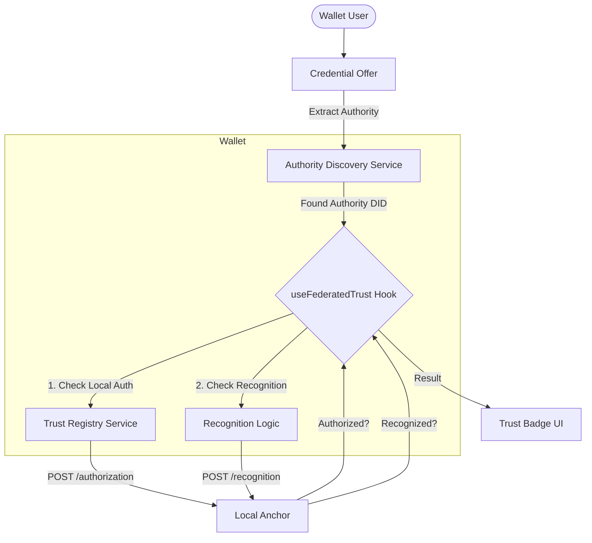

# 🏛️ Federation Strategy Architecture & Implementation Design

Dokumen ini menjelaskan arsitektur implementasi **Multi-Anchor Trust Registry** untuk Verifikasi Lintas Batas (Cross-Border Verification).

## 1. High-Level Architecture

System ini menggunakan pendekatan **Hybrid Discovery**:
1.  **Primary**: Mengekstrak informasi otoritas langsung dari Credential (`termsOfUse`).
2.  **Fallback (Future)**: Resolusi DID Issuer (`did:web`) untuk menemukan otoritas.



---

## 2. Detailed Data Flow (Phase 1: TermsOfUse)

### Scenario: User menerima Credential dari MIT (Foreign Issuer)

1.  **Input:** Credential Offer diterima.
    *   `issuerDid`: `did:web:registrar.mit.edu`
    *   `credential`:
        ```json
        {
          "termsOfUse": [{
            "type": "TrustFrameworkPolicy",
            "trustFramework": {
              "id": "did:web:ed.gov" // Foreign Authority
            }
          }]
        }
        ```

2.  **Step 1: Local Authorization Check (Existing)**
    *   Wallet query ke Local Anchor (`did:web:kemdikbud.go.id`).
    *   **Request:** `POST /authorization { entity_id: "did:web:registrar.mit.edu" }`
    *   **Result:** `authorized: false` (Karena MIT tidak terdaftar di Kemdikbud).

3.  **Step 2: Authority Discovery (New)**
    *   Wallet memanggil `AuthorityDiscoveryService.extractFromCredential(credential)`.
    *   **Logic:** Scan `termsOfUse` mencari type `TrustFrameworkPolicy`.
    *   **Result:** `foreignAuthorityDid = "did:web:ed.gov"`.

4.  **Step 3: Recognition Check (New)**
    *   Wallet query ke Local Anchor (`did:web:kemdikbud.go.id`).
    *   **Request:** `POST /recognition`
        ```json
        {
          "authority_id": "did:web:kemdikbud.go.id", // Local
          "entity_id": "did:web:ed.gov",             // Foreign Authority
          "action": "recognize"
        }
        ```
    *   **Response:** `recognized: true` (Jika ada kerjasama bilateral).

5.  **Output:** Status verifikasi menjadi `trusted_federation`.
    *   **UI:** Menampilkan badge khusus (e.g., Orange Shield dengan nama Anchor Asing).

---

## 3. Component & Service Design

### A. `AuthorityDiscoveryService` (New)
Service stateless (static methods) untuk ekstraksi informasi.

*   `extractFromCredential(credential: any): TrustFramework | null`
    *   Menerima JSON credential.
    *   Validasi struktur `termsOfUse`.
    *   Return object `TrustFramework` atau `null`.

### B. `TrustRegistryService` (Update)
Perluasan service existing untuk mendukung Recognition API.

> **PENTING**: Endpoint `/v2/authorization` **SUDAH TERIMPLEMENTASI** dan digunakan sebagai primary check. Endpoint `/v2/recognition` ditambahkan hanya sebagai pelengkap (complementary) untuk skenario Federation dimana primary check authorization mengembalikan `false` (unauthorized).

*   `checkAuthorization` (Existing): Cek authority lokal terhadap issuer.
*   `checkRecognition` (New): Endpoint `/v2/recognition`.
    *   Fungsi: Menanyakan apakah Local Authority mengakui Foreign Authority.
    *   Caching: `CacheKeys.recognition(entity_id)` (TTL: 1 hour - long cache).

### C. `useFederatedTrust` (New Hook)
Orchestrator utama logic federation.

*   **Inputs:** `issuerDid`, `credential` (optional), `credentialType`.
*   **Outputs:**
    ```typescript
    interface FederatedTrustResult {
      level: TrustLevel;          // 'trusted_local' | 'trusted_federation' | ...
      authorized: boolean;
      trustSource: 'local' | 'federation';
      anchor?: TrustAnchor;       // Anchor yang memverifikasi (Local atau Foreign)
    }
    ```

### D. `TrustAnchor` (Type Definition)
Definisi entitas anchor agar seragam.

```typescript
interface TrustAnchor {
  did: string;
  url: string;
  name?: string;
}
```

---

## 4. Integration Strategy

### Dimana kode ini dipasang?

1.  **`CredentialOffer.tsx`**: (Screen Penerimaan Credential)
    *   Di sini kita memiliki object `credential` lengkap dari offer.
    *   Panggil `useFederatedTrust` dengan passing `credential` tersebut.
    *   Gunakan hasil `trustResult` untuk menentukan warning/badge.

2.  **`CredentialList.tsx`**: (List Credential yang sudah disimpan)
    *   Credential yang tersimpan di wallet storage juga punya `termsOfUse`.
    *   Logic yang sama bisa dipakai untuk re-verify status trust.

### Configuration (`samples/app/config/trustRegistry.ts`)
Cukup mendefinisikan **Local Anchor** saja, karena Foreign Anchor didapat dinamis dari credential.

```typescript
export const config: TrustRegistryConfig = {
  enabled: true,
  url: 'https://trust.kemdikbud.go.id',
  ecosystemDid: 'did:web:kemdikbud.go.id',
  // Tidak perlu list hardcoded foreign anchors untuk Phase 1
}
```

---

## 5. Security & Risk

*   **Trust on First Use (TermsOfUse)**: Kita mempercayai *claim* issuer bahwa mereka di bawah otoritas X.
    *   **Mitigasi:** `Recognition Check` ke Local Anchor adalah "Gatekeeper". Walaupun issuer mengklaim authority X, jika Local Anchor tidak *recognize* authority X, maka tetap dianggap `untrusted`.
*   **Privacy**: Recognition check hanya mengirim DID Authority (`did:web:ed.gov`), bukan DID Issuer atau data user. Aman.
